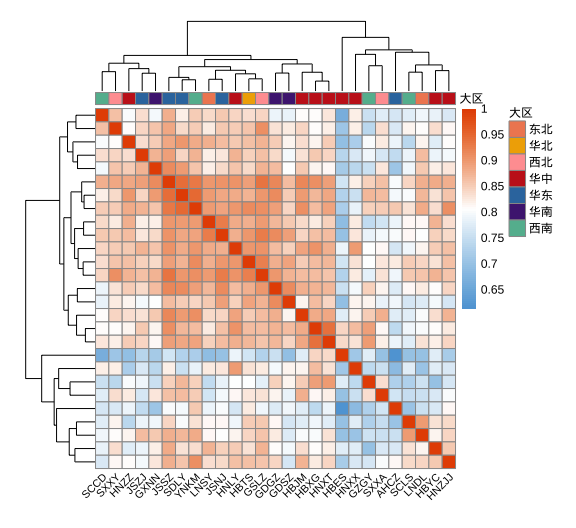

# 可视化案例

在生物信息学研究中，数据可视化是理解和解释数据的关键步骤。通过有效的可视化，研究人员可以更直观地展示数据的趋势、模式和关系，从而获得更深入的生物学见解。在这一部分，记录一些学习工作中R语言可视化案例。

## 条形图（Bar Plot）

## 散点图（Scatter Plot）

## 火山图（Volcano Plot）

## 热图（Heatmap）

### 案例1

样品相关性矩阵热图

**示例数据**

[遗传相似度.csv](https://res.craft.do/user/full/5cc4bf2e-e733-e007-a61a-a9eddc2e4039/doc/2C5F2FDC-E834-40B0-8C85-FF62441D8B14/EFEA2AF3-D5C9-470C-80B7-9EC8C99CA341_2/7y7ihL08TXyMaR8gGDAERxhqWRK4FTBiwZ7rrb8clhcz/EFEA2AF3-D5C9-470C-80B7-9EC8C99CA341_2.csv)
[热图注释文件](https://res.craft.do/user/full/5cc4bf2e-e733-e007-a61a-a9eddc2e4039/doc/2C5F2FDC-E834-40B0-8C85-FF62441D8B14/DC7AC362-2511-4273-8308-C5B9D62F6B7D_2/TfdqwPSxBO6gXxb3lxc1aYD1EVOchFSiwxJfgl3cQpEz/ann_col.csv "ann_col.csv")

```R
library(tidyverse)
library(pheatmap)
library(RColorBrewer)
library(showtext)
showtext_auto() # for Chinese characters
```

**加载数据**

```R
data <- read.csv(url.1, header = T,row.names = 1)
# transform the data to a matrix
data_mt <- as.matrix(data)

# columns ann file
ann_col <- read.csv(url.2, row.names = 1)
ann_colors <- list(大区 = c(东北="#f08961", 华北="#f0ad00", 西北="#ffa0a1",
                            华中="#c7231f", 华东="#3578ad", 
                            华南 = "#4f2580", 西南="#63b99e"))

# Set the color for the heatmap
mycols <- colorRampPalette(c("#5fa5d9", "white", "#e65100"))(100)
```

**Draw heatmap**

```R
pheatmap(data_mt, 
         cluster_rows = T, 
         cluster_cols = T, 
         annotation_col = ann_col,
         annotation_colors = ann_colors,
         color = mycols,
         fontsize = 9,
         fontsize_col = 8,
         cellwidth = 10,
         cellheight = 10,
         show_rownames = F,
         angle_col = 45)
```


