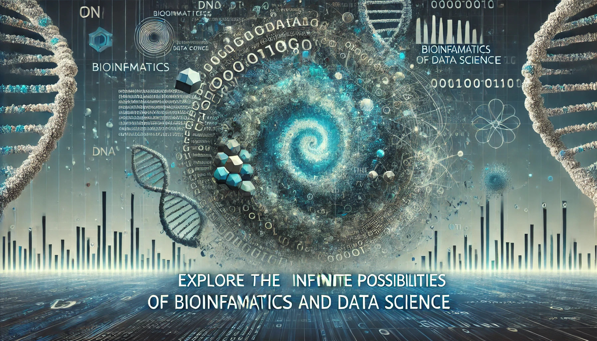

# Bioinformatics Notes

**🔭 为学日益，为道日损**

欢迎来到 Bioinformatics Notes！本网站是一个专注于生物信息学和数据科学领域的个人学习记录和知识整理平台。在这里，我记录了自己在工作中使用的工作流、学习的笔记，以及对各种工具和方法的总结。

!!! success "目标与愿景"
    本站的主要目的是帮助我自己更好地整理和回顾所学的知识，同时，也希望这些记录能对有相似需求的你有所帮助。请点击顶部或左侧的导航栏开始探索本站。

## 🔗 链接

-   :fontawesome-brands-github:{ .lg .middle } __Github__

    ---

    Github主页

    [:octicons-arrow-right-24: <a href="https://github.com/Shuaiwen-Cui" target="_blank"> 传送门 </a>](#)

### :material-contacts: 联系我

如果你有任何问题、建议或者希望交流的内容，欢迎与我联系。感谢你的访问，希望这里的内容能对你有所帮助！

:e-mail: - 1285141496@qq.com

